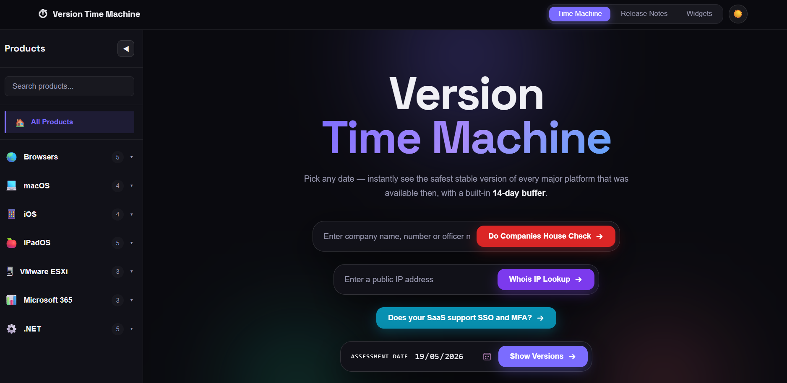
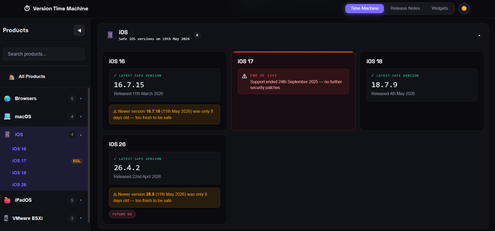
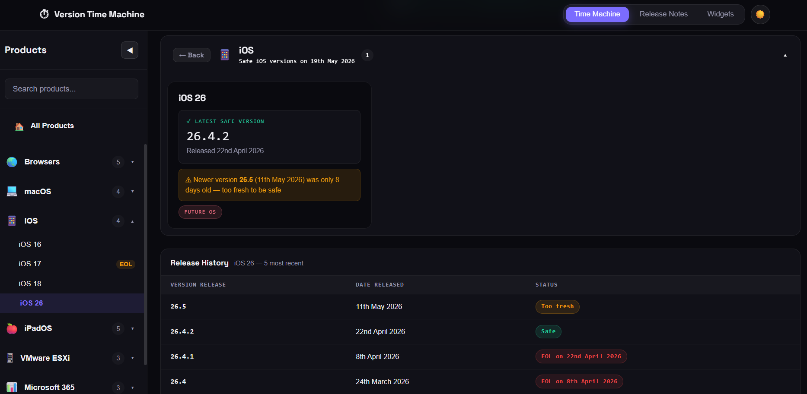

# Version Time Machine ⏱

A powerful web tool for moderators, compliance teams, and security auditors to check the latest safe/stable version of popular software at any given date in the past.

**Live Demo:** https://cool.cyberessentials.tools/versioncheck/



## Features

### Core Functionality
- **Historical Version Lookup** - Enter any date and instantly see the most recent stable versions available at that time
- **14-Day Safety Buffer** - Automatically filters out versions that are too fresh (less than 14 days old)
- **Multi-Platform Support** - Covers browsers, operating systems, server platforms, and development frameworks
- **EOL Warnings** - Visual indicators for End of Life products with support end dates

### Sidebar Navigation
- **Product Browser** - Organized sidebar with all products categorized by type



- **Smart Search** - Filter products by name in real-time
- **Category Selection** - Click any category to view all products in that group
- **Individual Selection** - Click specific products to focus on just that version
- **Collapsible Design** - Hide/show sidebar with smooth animations

### Supported Platforms

#### Browsers
- Google Chrome
- Microsoft Edge
- Mozilla Firefox
- Safari (versions 18 & 26)

#### Operating Systems
- **macOS** - Ventura (13), Sonoma (14), Sequoia (15), Tahoe (26)
- **iOS** - Versions 16, 17, 18, 26
- **iPadOS** - Versions 15, 16, 17, 18, 26

#### Server & Infrastructure
- **VMware ESXi** - Versions 7, 8, 9
- **Microsoft 365** - Current Channel, Monthly Enterprise, Semi-Annual Enterprise

#### Development Frameworks
- **.NET** - Versions 7, 8, 9, 10, 11

### Release Notes & Documentation
Browse official vendor documentation organized by category:
- Browsers
- Operating Systems
- Business Antivirus
- Servers
- Firewalls
- AWS Services
- Software Support Policies

## Usage

### Basic Workflow

1. **Select a Date**
   - Use the date picker to choose your assessment date
   - Click "Show Versions" to see results

2. **Browse Results**
   - All supported platforms are displayed by default
   - Sections are collapsed - click headers to expand
   - Each card shows the latest safe version for that date

3. **Use the Sidebar**
   - **All Products** - Default view showing everything
   - **Search** - Type to filter products by name
   - **Categories** - Click category headers to view all products in that group
   - **Individual Products** - Click specific products to focus on one

### Understanding the Results

Each version card displays:
- **Safe Version** - The recommended stable version (14+ days old)
- **Release Date** - When that version was released
- **Fresh Warning** - If a newer version existed but was too fresh
- **EOL Badge** - For products that have reached End of Life



- **Future Badge** - For upcoming OS versions

### Example Scenarios

**Compliance Check:**
```
Date: January 1, 2025
Question: Was Chrome 131 compliant?
Action: Check if Chrome 131 was the safe version on that date
```

**Security Audit:**
```
Date: March 15, 2024
Question: What macOS versions should have been patched?
Action: Select "macOS" category to see all versions
```

## How It Works

### Safety Buffer Logic
The tool applies a 14-day maturity buffer to ensure stability:

1. Finds all versions released on or before the selected date
2. Filters for versions that are at least 14 days old
3. Returns the most recent version that meets this criteria
4. Flags newer versions as "too fresh" if they don't meet the buffer

